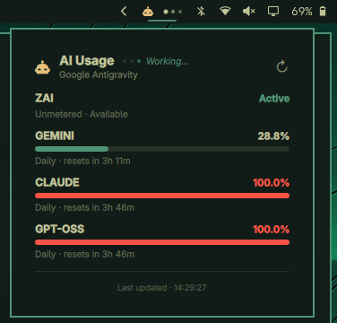

# OMP Usagebar — Omarchy Quattro Plugin

A native, theme-aware Omarchy Quattro plugin providing a real-time visual indicator and dashboard for **[Oh My Pi (OMP)](https://github.com/can1357/oh-my-pi)** AI usage, quota tracking, and activity state.



---

## ✨ Features

- 🤖 **Native Omarchy Quattro Integration**: Uses the official Omarchy robot icon glyph (`󱚣`), typography, and border styling for a seamless system panel experience.
- 🎨 **100% Theme-Aware**: Dynamically follows the active Omarchy theme colors in real time without restarting.
- 📊 **Dynamic Model & Quota Tracking**: Dynamically lists and separates all configured models (Gemini, Claude, GPT-OSS, GLM/Zai, etc.) sorted with least used on top.
- ⚡ **Thinking Indicator Animation**: Smoothly slides the robot icon to reveal three animated pulsing dots in the top bar whenever OMP is generating or streaming.
- 📈 **Token Consumption Dashboard**: Integrates with `omp stats` to break down token counts per model and display the grand total consumed.
- 🟡 **Intelligent Quota Alarms**: Differentiates between partial provider exhaustion (Yellow warning) and complete multi-provider exhaustion (Red urgent).
- ⏱️ **Adaptive Polling**: Lightweight process execution (60s idle, 5s panel open, 3s active prompt).
- 🛡️ **Graceful Error Handling**: Caches last-known valid usage snapshot during transient errors.

---

## 📦 Installation

1. Clone or link the repository into your Omarchy plugins directory:

```bash
mkdir -p ~/.config/omarchy/plugins
git clone https://github.com/Medo23643/omp-usagebar.git ~/.config/omarchy/plugins/omp.usagebar
```

2. Validate and enable the plugin:

```bash
omarchy plugin validate ~/.config/omarchy/plugins/omp.usagebar
omarchy plugin enable omp.usagebar
omarchy restart shell
```

---

## 📂 Project Structure

```
omp-usagebar/
├── manifest.json                  # Plugin manifest contract
├── Panel.qml                      # Bar widget & KeyboardPanel dashboard
├── Main.qml                       # omp usage & stats polling engine
├── Activity.qml                   # Subprocess activity detector
├── components/
│   ├── ActivityBars.qml           # Thinking wave dots animation
│   ├── QuotaCard.qml              # Full-width quota meters & reset countdowns
│   ├── SeverityProgressBar.qml    # Theme & severity-colored meter bar
│   └── TokenRow.qml               # Formatted token consumption rows
├── assets/
│   └── preview.png                # Dashboard preview screenshot
└── README.md
```

---

## 🙏 Credits & Acknowledgements

- **Inspiration**: Inspired by **[ai-usagebar](https://github.com/akitaonrails/ai-usagebar)** by [@akitaonrails](https://github.com/akitaonrails) — thank you for pioneering beautiful AI quota monitoring on the Linux desktop!
- **AI Agent**: Built for **[Oh My Pi (OMP)](https://github.com/can1357/oh-my-pi)** by [@can1357](https://github.com/can1357).
- **Desktop Environment**: Built for **[Omarchy Quattro](https://omarchy.org)** and **[Quickshell](https://quickshell.org)**.

---

## 👤 Author

- **Mohammed** ([@Medo23643](https://github.com/Medo23643))

---

## 📄 License

This project is licensed under the [MIT License](LICENSE).
